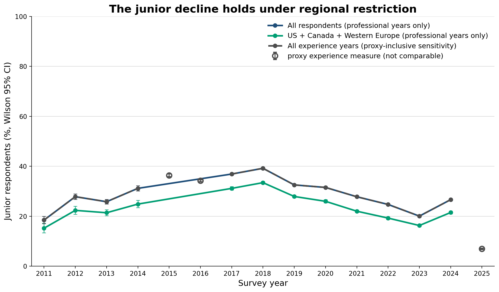
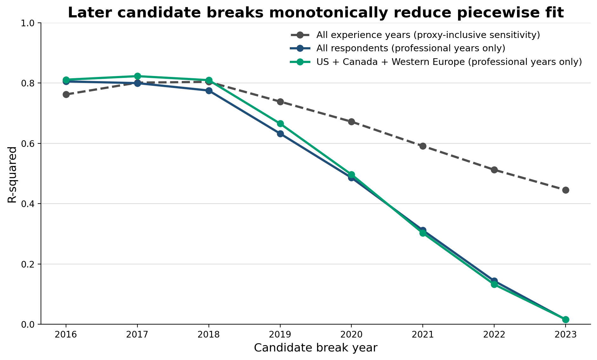

# Robustness, placebo breaks, and confidence intervals

The annual chart uses the single kept cohort allocator and Wilson 95% intervals; hollow points are proxy measures. The two primary regression series exclude 2015, 2016, and 2025, including the US + Canada + Western Europe series. `All experience years (proxy-inclusive sensitivity)` deliberately retains all 15 points as a separately labelled sensitivity block; it is not used as the comparable-measure result. Country restriction uses the same UN M49 Western Europe definition documented in the audit.

## Annual junior series

| Series | Year | Parsable n | Junior | Wilson 95% CI |
| --- | --- | --- | --- | --- |
| All experience years (proxy-inclusive sensitivity) | 2011 | 2729 | 0.184866 | [0.170748, 0.199870] |
| All experience years (proxy-inclusive sensitivity) | 2012 | 5964 | 0.278504 | [0.267273, 0.290021] |
| All experience years (proxy-inclusive sensitivity) | 2013 | 9436 | 0.258266 | [0.249535, 0.267194] |
| All experience years (proxy-inclusive sensitivity) | 2014 | 7346 | 0.311802 | [0.301310, 0.322491] |
| All experience years (proxy-inclusive sensitivity) | 2015 | 24827 | 0.364059 | [0.358096, 0.370065] |
| All experience years (proxy-inclusive sensitivity) | 2016 | 49520 | 0.342276 | [0.338109, 0.346467] |
| All experience years (proxy-inclusive sensitivity) | 2017 | 40890 | 0.369076 | [0.364411, 0.373765] |
| All experience years (proxy-inclusive sensitivity) | 2018 | 77903 | 0.392047 | [0.388625, 0.395481] |
| All experience years (proxy-inclusive sensitivity) | 2019 | 74331 | 0.325544 | [0.322184, 0.328921] |
| All experience years (proxy-inclusive sensitivity) | 2020 | 46349 | 0.315454 | [0.311239, 0.319700] |
| All experience years (proxy-inclusive sensitivity) | 2021 | 61216 | 0.278195 | [0.274659, 0.281759] |
| All experience years (proxy-inclusive sensitivity) | 2022 | 51833 | 0.247371 | [0.243676, 0.251105] |
| All experience years (proxy-inclusive sensitivity) | 2023 | 66136 | 0.200708 | [0.197672, 0.203778] |
| All experience years (proxy-inclusive sensitivity) | 2024 | 51610 | 0.266537 | [0.262740, 0.270369] |
| All experience years (proxy-inclusive sensitivity) | 2025 | 42929 | 0.069580 | [0.067211, 0.072026] |
| All respondents (professional years only) | 2011 | 2729 | 0.184866 | [0.170748, 0.199870] |
| All respondents (professional years only) | 2012 | 5964 | 0.278504 | [0.267273, 0.290021] |
| All respondents (professional years only) | 2013 | 9436 | 0.258266 | [0.249535, 0.267194] |
| All respondents (professional years only) | 2014 | 7346 | 0.311802 | [0.301310, 0.322491] |
| All respondents (professional years only) | 2015 | 0 | NOT AVAILABLE | [NOT AVAILABLE, NOT AVAILABLE] |
| All respondents (professional years only) | 2016 | 0 | NOT AVAILABLE | [NOT AVAILABLE, NOT AVAILABLE] |
| All respondents (professional years only) | 2017 | 40890 | 0.369076 | [0.364411, 0.373765] |
| All respondents (professional years only) | 2018 | 77903 | 0.392047 | [0.388625, 0.395481] |
| All respondents (professional years only) | 2019 | 74331 | 0.325544 | [0.322184, 0.328921] |
| All respondents (professional years only) | 2020 | 46349 | 0.315454 | [0.311239, 0.319700] |
| All respondents (professional years only) | 2021 | 61216 | 0.278195 | [0.274659, 0.281759] |
| All respondents (professional years only) | 2022 | 51833 | 0.247371 | [0.243676, 0.251105] |
| All respondents (professional years only) | 2023 | 66136 | 0.200708 | [0.197672, 0.203778] |
| All respondents (professional years only) | 2024 | 51610 | 0.266537 | [0.262740, 0.270369] |
| All respondents (professional years only) | 2025 | 0 | NOT AVAILABLE | [NOT AVAILABLE, NOT AVAILABLE] |
| US + Canada + Western Europe (professional years only) | 2011 | 1383 | 0.152205 | [0.134238, 0.172099] |
| US + Canada + Western Europe (professional years only) | 2012 | 2588 | 0.223725 | [0.208085, 0.240183] |
| US + Canada + Western Europe (professional years only) | 2013 | 4546 | 0.214144 | [0.202463, 0.226308] |
| US + Canada + Western Europe (professional years only) | 2014 | 3338 | 0.248802 | [0.234430, 0.263751] |
| US + Canada + Western Europe (professional years only) | 2015 | 0 | NOT AVAILABLE | [NOT AVAILABLE, NOT AVAILABLE] |
| US + Canada + Western Europe (professional years only) | 2016 | 0 | NOT AVAILABLE | [NOT AVAILABLE, NOT AVAILABLE] |
| US + Canada + Western Europe (professional years only) | 2017 | 17655 | 0.311696 | [0.304906, 0.318569] |
| US + Canada + Western Europe (professional years only) | 2018 | 30955 | 0.334679 | [0.329443, 0.339956] |
| US + Canada + Western Europe (professional years only) | 2019 | 31917 | 0.279318 | [0.274423, 0.284267] |
| US + Canada + Western Europe (professional years only) | 2020 | 18233 | 0.259913 | [0.253598, 0.266330] |
| US + Canada + Western Europe (professional years only) | 2021 | 23670 | 0.220363 | [0.215129, 0.225689] |
| US + Canada + Western Europe (professional years only) | 2022 | 21115 | 0.192801 | [0.187536, 0.198178] |
| US + Canada + Western Europe (professional years only) | 2023 | 29523 | 0.163093 | [0.158923, 0.167351] |
| US + Canada + Western Europe (professional years only) | 2024 | 20846 | 0.215149 | [0.209624, 0.220780] |
| US + Canada + Western Europe (professional years only) | 2025 | 0 | NOT AVAILABLE | [NOT AVAILABLE, NOT AVAILABLE] |

## Placebo-scan summary

| Break year | Series | Slope change | p-value | R-squared |
| --- | --- | --- | --- | --- |
| 2016 | All experience years (proxy-inclusive sensitivity) | -0.066464 | 0.000098 | 0.762176 |
| 2016 | All respondents (professional years only) | -0.062645 | 0.000180 | 0.805268 |
| 2016 | US + Canada + Western Europe (professional years only) | -0.056567 | 0.000156 | 0.811109 |
| 2017 | All experience years (proxy-inclusive sensitivity) | -0.062920 | 0.000033 | 0.801271 |
| 2017 | All respondents (professional years only) | -0.052274 | 0.000205 | 0.799680 |
| 2017 | US + Canada + Western Europe (professional years only) | -0.047708 | 0.000116 | 0.822834 |
| 2018 | All experience years (proxy-inclusive sensitivity) | -0.061360 | 0.000030 | 0.803914 |
| 2018 | All respondents (professional years only) | -0.049305 | 0.000348 | 0.775250 |
| 2018 | US + Canada + Western Europe (professional years only) | -0.045333 | 0.000162 | 0.809566 |
| 2019 | All experience years (proxy-inclusive sensitivity) | -0.059965 | 0.000176 | 0.738454 |
| 2019 | All respondents (professional years only) | -0.046546 | 0.003441 | 0.632474 |
| 2019 | US + Canada + Western Europe (professional years only) | -0.042963 | 0.002202 | 0.665494 |
| 2020 | All experience years (proxy-inclusive sensitivity) | -0.061642 | 0.000718 | 0.671866 |
| 2020 | All respondents (professional years only) | -0.046287 | 0.017153 | 0.486128 |
| 2020 | US + Canada + Western Europe (professional years only) | -0.042103 | 0.015463 | 0.496597 |
| 2021 | All experience years (proxy-inclusive sensitivity) | -0.066332 | 0.002863 | 0.591051 |
| 2021 | All respondents (professional years only) | -0.046393 | 0.074532 | 0.311734 |
| 2021 | US + Canada + Western Europe (professional years only) | -0.041154 | 0.079560 | 0.302635 |
| 2022 | All experience years (proxy-inclusive sensitivity) | -0.077255 | 0.008829 | 0.512369 |
| 2022 | All respondents (professional years only) | -0.045691 | 0.251299 | 0.143751 |
| 2022 | US + Canada + Western Europe (professional years only) | -0.039509 | 0.271675 | 0.132268 |
| 2023 | All experience years (proxy-inclusive sensitivity) | -0.103682 | 0.020502 | 0.445323 |
| 2023 | All respondents (professional years only) | -0.028954 | 0.719806 | 0.015731 |
| 2023 | US + Canada + Western Europe (professional years only) | -0.027122 | 0.708686 | 0.016323 |

## Fit ranking

**All experience years (proxy-inclusive sensitivity)**: best fit is 2018 (R-squared 0.803914); 2022 ranks 7 of 8.

**All respondents (professional years only)**: best fit is 2016 (R-squared 0.805268); 2022 ranks 7 of 8.

**US + Canada + Western Europe (professional years only)**: best fit is 2017 (R-squared 0.822834); 2022 ranks 7 of 8.

## Piecewise regressions

Each regression is `junior = const + time + slope_change × max(0, time)`; therefore the `slope_change` p-value tests a slope difference only, not a level shift.

| Series | Break | n | Coefficient | Estimate | SE | 95% CI | p-value | R-squared |
| --- | --- | --- | --- | --- | --- | --- | --- | --- |
| All experience years (proxy-inclusive sensitivity) | 2016 | 15 | const | 0.399811 | 0.022494 | [0.350801, 0.448821] | 0.000000 | 0.762176 |
| All experience years (proxy-inclusive sensitivity) | 2016 | 15 | time | 0.039934 | 0.008522 | [0.021365, 0.058502] | 0.000527 | 0.762176 |
| All experience years (proxy-inclusive sensitivity) | 2016 | 15 | slope_change | -0.066464 | 0.011644 | [-0.091833, -0.041095] | 0.000098 | 0.762176 |
| All experience years (proxy-inclusive sensitivity) | 2017 | 15 | const | 0.399895 | 0.020570 | [0.355077, 0.444714] | 0.000000 | 0.801271 |
| All experience years (proxy-inclusive sensitivity) | 2017 | 15 | time | 0.031398 | 0.006341 | [0.017582, 0.045214] | 0.000335 | 0.801271 |
| All experience years (proxy-inclusive sensitivity) | 2017 | 15 | slope_change | -0.062920 | 0.009784 | [-0.084238, -0.041602] | 0.000033 | 0.801271 |
| All experience years (proxy-inclusive sensitivity) | 2018 | 15 | const | 0.394824 | 0.020435 | [0.350299, 0.439348] | 0.000000 | 0.803914 |
| All experience years (proxy-inclusive sensitivity) | 2018 | 15 | time | 0.024326 | 0.005295 | [0.012789, 0.035863] | 0.000617 | 0.803914 |
| All experience years (proxy-inclusive sensitivity) | 2018 | 15 | slope_change | -0.061360 | 0.009460 | [-0.081971, -0.040749] | 0.000030 | 0.803914 |
| All experience years (proxy-inclusive sensitivity) | 2019 | 15 | const | 0.381869 | 0.023598 | [0.330453, 0.433285] | 0.000000 | 0.738454 |
| All experience years (proxy-inclusive sensitivity) | 2019 | 15 | time | 0.017632 | 0.005265 | [0.006161, 0.029103] | 0.005790 | 0.738454 |
| All experience years (proxy-inclusive sensitivity) | 2019 | 15 | slope_change | -0.059965 | 0.011224 | [-0.084421, -0.035509] | 0.000176 | 0.738454 |
| All experience years (proxy-inclusive sensitivity) | 2020 | 15 | const | 0.366646 | 0.026422 | [0.309077, 0.424214] | 0.000000 | 0.671866 |
| All experience years (proxy-inclusive sensitivity) | 2020 | 15 | time | 0.012359 | 0.005169 | [0.001096, 0.023622] | 0.034085 | 0.671866 |
| All experience years (proxy-inclusive sensitivity) | 2020 | 15 | slope_change | -0.061642 | 0.013677 | [-0.091441, -0.031843] | 0.000718 | 0.671866 |
| All experience years (proxy-inclusive sensitivity) | 2021 | 15 | const | 0.348087 | 0.029475 | [0.283868, 0.412307] | 0.000000 | 0.591051 |
| All experience years (proxy-inclusive sensitivity) | 2021 | 15 | time | 0.007860 | 0.005131 | [-0.003319, 0.019039] | 0.151469 | 0.591051 |
| All experience years (proxy-inclusive sensitivity) | 2021 | 15 | slope_change | -0.066332 | 0.017774 | [-0.105058, -0.027606] | 0.002863 | 0.591051 |
| All experience years (proxy-inclusive sensitivity) | 2022 | 15 | const | 0.327711 | 0.032142 | [0.257680, 0.397742] | 0.000000 | 0.512369 |
| All experience years (proxy-inclusive sensitivity) | 2022 | 15 | time | 0.004131 | 0.005037 | [-0.006845, 0.015106] | 0.428192 | 0.512369 |
| All experience years (proxy-inclusive sensitivity) | 2022 | 15 | slope_change | -0.077255 | 0.024749 | [-0.131178, -0.023332] | 0.008829 | 0.512369 |
| All experience years (proxy-inclusive sensitivity) | 2023 | 15 | const | 0.306282 | 0.034190 | [0.231788, 0.380776] | 0.000001 | 0.445323 |
| All experience years (proxy-inclusive sensitivity) | 2023 | 15 | time | 0.001052 | 0.004872 | [-0.009564, 0.011668] | 0.832690 | 0.445323 |
| All experience years (proxy-inclusive sensitivity) | 2023 | 15 | slope_change | -0.103682 | 0.038867 | [-0.188366, -0.018997] | 0.020502 | 0.445323 |
| All respondents (professional years only) | 2016 | 12 | const | 0.400129 | 0.021098 | [0.352402, 0.447856] | 0.000000 | 0.805268 |
| All respondents (professional years only) | 2016 | 12 | time | 0.040093 | 0.006823 | [0.024659, 0.055527] | 0.000236 | 0.805268 |
| All respondents (professional years only) | 2016 | 12 | slope_change | -0.062645 | 0.010273 | [-0.085885, -0.039405] | 0.000180 | 0.805268 |
| All respondents (professional years only) | 2017 | 12 | const | 0.384007 | 0.018732 | [0.341632, 0.426383] | 0.000000 | 0.799680 |
| All respondents (professional years only) | 2017 | 12 | time | 0.028395 | 0.005110 | [0.016835, 0.039955] | 0.000353 | 0.799680 |
| All respondents (professional years only) | 2017 | 12 | slope_change | -0.052274 | 0.008725 | [-0.072011, -0.032536] | 0.000205 | 0.799680 |
| All respondents (professional years only) | 2018 | 12 | const | 0.375612 | 0.018623 | [0.333485, 0.417740] | 0.000000 | 0.775250 |
| All respondents (professional years only) | 2018 | 12 | time | 0.021782 | 0.004420 | [0.011784, 0.031781] | 0.000815 | 0.775250 |
| All respondents (professional years only) | 2018 | 12 | slope_change | -0.049305 | 0.008853 | [-0.069333, -0.029277] | 0.000348 | 0.775250 |
| All respondents (professional years only) | 2019 | 12 | const | 0.362407 | 0.022975 | [0.310433, 0.414381] | 0.000000 | 0.632474 |
| All respondents (professional years only) | 2019 | 12 | time | 0.015880 | 0.004829 | [0.004955, 0.026805] | 0.009406 | 0.632474 |
| All respondents (professional years only) | 2019 | 12 | slope_change | -0.046546 | 0.011834 | [-0.073317, -0.019775] | 0.003441 | 0.632474 |
| All respondents (professional years only) | 2020 | 12 | const | 0.348891 | 0.026576 | [0.288772, 0.409010] | 0.000000 | 0.486128 |
| All respondents (professional years only) | 2020 | 12 | time | 0.011364 | 0.005009 | [0.000033, 0.022694] | 0.049462 | 0.486128 |
| All respondents (professional years only) | 2020 | 12 | slope_change | -0.046287 | 0.015875 | [-0.082199, -0.010375] | 0.017153 | 0.486128 |
| All respondents (professional years only) | 2021 | 12 | const | 0.332360 | 0.030317 | [0.263778, 0.400941] | 0.000002 | 0.311734 |
| All respondents (professional years only) | 2021 | 12 | time | 0.007410 | 0.005172 | [-0.004289, 0.019109] | 0.185716 | 0.311734 |
| All respondents (professional years only) | 2021 | 12 | slope_change | -0.046393 | 0.023006 | [-0.098435, 0.005650] | 0.074532 | 0.311734 |
| All respondents (professional years only) | 2022 | 12 | const | 0.313996 | 0.033456 | [0.238314, 0.389678] | 0.000006 | 0.143751 |
| All respondents (professional years only) | 2022 | 12 | time | 0.004050 | 0.005207 | [-0.007730, 0.015830] | 0.456678 | 0.143751 |
| All respondents (professional years only) | 2022 | 12 | slope_change | -0.045691 | 0.037268 | [-0.129996, 0.038614] | 0.251299 | 0.143751 |
| All respondents (professional years only) | 2023 | 12 | const | 0.294295 | 0.035464 | [0.214069, 0.374520] | 0.000017 | 0.015731 |
| All respondents (professional years only) | 2023 | 12 | time | 0.001197 | 0.005076 | [-0.010285, 0.012679] | 0.818859 | 0.015731 |
| All respondents (professional years only) | 2023 | 12 | slope_change | -0.028954 | 0.078215 | [-0.205888, 0.147980] | 0.719806 | 0.015731 |
| US + Canada + Western Europe (professional years only) | 2016 | 12 | const | 0.338427 | 0.018688 | [0.296153, 0.380701] | 0.000000 | 0.811109 |
| US + Canada + Western Europe (professional years only) | 2016 | 12 | time | 0.035963 | 0.006043 | [0.022293, 0.049634] | 0.000215 | 0.811109 |
| US + Canada + Western Europe (professional years only) | 2016 | 12 | slope_change | -0.056567 | 0.009100 | [-0.077152, -0.035982] | 0.000156 | 0.811109 |
| US + Canada + Western Europe (professional years only) | 2017 | 12 | const | 0.324584 | 0.015843 | [0.288744, 0.360424] | 0.000000 | 0.822834 |
| US + Canada + Western Europe (professional years only) | 2017 | 12 | time | 0.025671 | 0.004322 | [0.015894, 0.035448] | 0.000218 | 0.822834 |
| US + Canada + Western Europe (professional years only) | 2017 | 12 | slope_change | -0.047708 | 0.007379 | [-0.064401, -0.031015] | 0.000116 | 0.822834 |
| US + Canada + Western Europe (professional years only) | 2018 | 12 | const | 0.317287 | 0.015417 | [0.282412, 0.352162] | 0.000000 | 0.809566 |
| US + Canada + Western Europe (professional years only) | 2018 | 12 | time | 0.019781 | 0.003659 | [0.011504, 0.028058] | 0.000430 | 0.809566 |
| US + Canada + Western Europe (professional years only) | 2018 | 12 | slope_change | -0.045333 | 0.007329 | [-0.061913, -0.028753] | 0.000162 | 0.809566 |
| US + Canada + Western Europe (professional years only) | 2019 | 12 | const | 0.305173 | 0.019713 | [0.260579, 0.349766] | 0.000000 | 0.665494 |
| US + Canada + Western Europe (professional years only) | 2019 | 12 | time | 0.014410 | 0.004144 | [0.005036, 0.023783] | 0.006965 | 0.665494 |
| US + Canada + Western Europe (professional years only) | 2019 | 12 | slope_change | -0.042963 | 0.010154 | [-0.065932, -0.019994] | 0.002202 | 0.665494 |
| US + Canada + Western Europe (professional years only) | 2020 | 12 | const | 0.291613 | 0.023656 | [0.238099, 0.345127] | 0.000001 | 0.496597 |
| US + Canada + Western Europe (professional years only) | 2020 | 12 | time | 0.010094 | 0.004458 | [0.000008, 0.020179] | 0.049854 | 0.496597 |
| US + Canada + Western Europe (professional years only) | 2020 | 12 | slope_change | -0.042103 | 0.014131 | [-0.074070, -0.010136] | 0.015463 | 0.496597 |
| US + Canada + Western Europe (professional years only) | 2021 | 12 | const | 0.275308 | 0.027445 | [0.213224, 0.337393] | 0.000003 | 0.302635 |
| US + Canada + Western Europe (professional years only) | 2021 | 12 | time | 0.006339 | 0.004682 | [-0.004252, 0.016930] | 0.208761 | 0.302635 |
| US + Canada + Western Europe (professional years only) | 2021 | 12 | slope_change | -0.041154 | 0.020826 | [-0.088267, 0.005958] | 0.079560 | 0.302635 |
| US + Canada + Western Europe (professional years only) | 2022 | 12 | const | 0.258186 | 0.030289 | [0.189667, 0.326705] | 0.000013 | 0.132268 |
| US + Canada + Western Europe (professional years only) | 2022 | 12 | time | 0.003276 | 0.004715 | [-0.007389, 0.013941] | 0.504662 | 0.132268 |
| US + Canada + Western Europe (professional years only) | 2022 | 12 | slope_change | -0.039509 | 0.033740 | [-0.115835, 0.036817] | 0.271675 | 0.132268 |
| US + Canada + Western Europe (professional years only) | 2023 | 12 | const | 0.241403 | 0.031885 | [0.169275, 0.313531] | 0.000034 | 0.016323 |
| US + Canada + Western Europe (professional years only) | 2023 | 12 | time | 0.000868 | 0.004563 | [-0.009455, 0.011191] | 0.853351 | 0.016323 |
| US + Canada + Western Europe (professional years only) | 2023 | 12 | slope_change | -0.027122 | 0.070321 | [-0.186198, 0.131955] | 0.708686 | 0.016323 |

## 2020/2022 versus placebo breaks

The two comparable-measure series use only professional-experience years; the n=15 proxy-inclusive series is retained solely to display the leverage of proxy years. Read the ranking and summary table before treating a nominal p-value at any selected knot as confirmatory evidence.

2020/2022 slope rows:

| Series | Break | n | Coefficient | Estimate | SE | 95% CI | p-value | R-squared |
| --- | --- | --- | --- | --- | --- | --- | --- | --- |
| All experience years (proxy-inclusive sensitivity) | 2020 | 15 | slope_change | -0.061642 | 0.013677 | [-0.091441, -0.031843] | 0.000718 | 0.671866 |
| All experience years (proxy-inclusive sensitivity) | 2022 | 15 | slope_change | -0.077255 | 0.024749 | [-0.131178, -0.023332] | 0.008829 | 0.512369 |
| All respondents (professional years only) | 2020 | 12 | slope_change | -0.046287 | 0.015875 | [-0.082199, -0.010375] | 0.017153 | 0.486128 |
| All respondents (professional years only) | 2022 | 12 | slope_change | -0.045691 | 0.037268 | [-0.129996, 0.038614] | 0.251299 | 0.143751 |
| US + Canada + Western Europe (professional years only) | 2020 | 12 | slope_change | -0.042103 | 0.014131 | [-0.074070, -0.010136] | 0.015463 | 0.496597 |
| US + Canada + Western Europe (professional years only) | 2022 | 12 | slope_change | -0.039509 | 0.033740 | [-0.115835, 0.036817] | 0.271675 | 0.132268 |

## Power note

Minimum detectable absolute slope changes at 80% power, two-sided alpha=0.05, are design- and residual-SD-specific. The values below use each fitted model's residual SD and exact broken-stick design; they are not claims about an unspecified generic n. The comparable-measure samples contain n=12 annual points; the labelled proxy-inclusive sensitivity sample contains n=15. **NOT AVAILABLE for a generic n without the actual observation years, knot placement, and residual SD.**

| Series | Break | n | MDE (slope-change units/year) |
| --- | --- | --- | --- |
| All experience years (proxy-inclusive sensitivity) | 2016 | 15 | 0.035544 |
| All experience years (proxy-inclusive sensitivity) | 2017 | 15 | 0.029868 |
| All experience years (proxy-inclusive sensitivity) | 2018 | 15 | 0.028877 |
| All experience years (proxy-inclusive sensitivity) | 2019 | 15 | 0.034265 |
| All experience years (proxy-inclusive sensitivity) | 2020 | 15 | 0.041750 |
| All experience years (proxy-inclusive sensitivity) | 2021 | 15 | 0.054257 |
| All experience years (proxy-inclusive sensitivity) | 2022 | 15 | 0.075550 |
| All experience years (proxy-inclusive sensitivity) | 2023 | 15 | 0.118649 |
| All respondents (professional years only) | 2016 | 12 | 0.032358 |
| All respondents (professional years only) | 2017 | 12 | 0.027481 |
| All respondents (professional years only) | 2018 | 12 | 0.027885 |
| All respondents (professional years only) | 2019 | 12 | 0.037273 |
| All respondents (professional years only) | 2020 | 12 | 0.050001 |
| All respondents (professional years only) | 2021 | 12 | 0.072459 |
| All respondents (professional years only) | 2022 | 12 | 0.117379 |
| All respondents (professional years only) | 2023 | 12 | 0.246348 |
| US + Canada + Western Europe (professional years only) | 2016 | 12 | 0.028661 |
| US + Canada + Western Europe (professional years only) | 2017 | 12 | 0.023242 |
| US + Canada + Western Europe (professional years only) | 2018 | 12 | 0.023084 |
| US + Canada + Western Europe (professional years only) | 2019 | 12 | 0.031980 |
| US + Canada + Western Europe (professional years only) | 2020 | 12 | 0.044508 |
| US + Canada + Western Europe (professional years only) | 2021 | 12 | 0.065595 |
| US + Canada + Western Europe (professional years only) | 2022 | 12 | 0.106269 |
| US + Canada + Western Europe (professional years only) | 2023 | 12 | 0.221484 |
